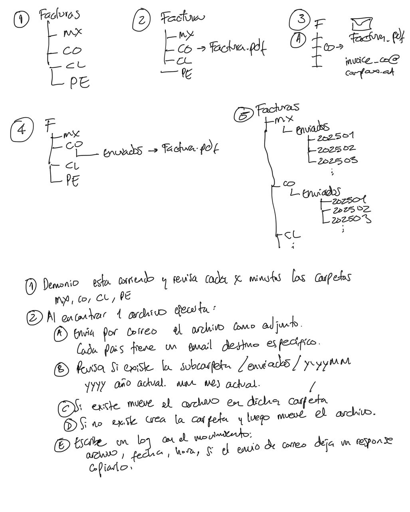

# Descripcion del problema
1. Hay que enviar cada factura a un correo como adjunto, eso hace que tenga que tener un control de que envía y que no.
2. Es un correo por cada país (México. Colombia. Peru. Chile)

### Descripcion del objetivo
- Crear en un folder 4 folderes, uno por cada país.
  La idea es tener un demonio que esté revisando cuando haya un archivo en cada folder, y envíe el archivo por correo y lo mueva después a una sub carpeta de enviados.

## 

## Como convertirlo en ejecutable en cualquier maquina?
1. Install and Open Launch4j
2. Extract the ZIP: Unzip the downloaded file to a folder and open launch4j.exe (Windows) or launch4j (macOS/Linux).
3. Configure Launch4j to Create an Executable, Open Launch4j: Launch launch4j.exe.
4. Set Up the JAR File(previously created, check pom build comments)
5. Output file: Choose where you want the .exe to be saved. This is where your executable will be generated (e.g., C:\path\to\output\my-application.exe).
Jar: Browse and select your JAR file (e.g., my-application.jar).
6. Configure JRE (Java Runtime Environment):
Min JRE version: Enter the minimum required Java version (e.g., 1.8.0 or 11 depending on your application's requirements, 17 in this case).
Bundled JRE (optional): You can bundle a JRE with your executable if you want to make it more portable. If you have a specific version of the JRE that you want to bundle, you can select the "Bundled JRE" option and provide the path to the JRE folder.
7. Specify Application Main Class:
Under the Main Class section, you need to provide the fully-qualified name of your main class (e.g., com.myapp.Main).
This is the class that contains your public static void main(String[] args) method.
8. JVM Options (Optional):
If you have any specific JVM options (e.g., memory settings), you can specify them here (e.g., -Xmx1024m for setting max heap size).
9. Icon (Optional):
You can set a custom icon for the executable by specifying an .ico file under Icon. This will change the icon of the .exe file that is generated.
10. Single Instance: You can check "Single instance" if you want only one instance of the application to run at a time.
11. Error Handling: You can choose to show a dialog on errors or just log them in a file.
12. Build the Executable
After configuring everything, click the Build Wrapper button on the bottom-right corner. This will generate the .exe file.
Once the build is successful, the .exe file will be available at the location you specified in the Output file field.
13. Test the Executable
Once the .exe is generated:
Try running the .exe file on a Windows machine that has Java installed. The application should launch as if it were a native application.
You can run it from the command line like this:

path\to\your-application.exe

Make sure to test it on another machine (or a fresh environment) to ensure it runs without issues. If you've bundled a JRE, the application should run even if Java is not installed on the machine.